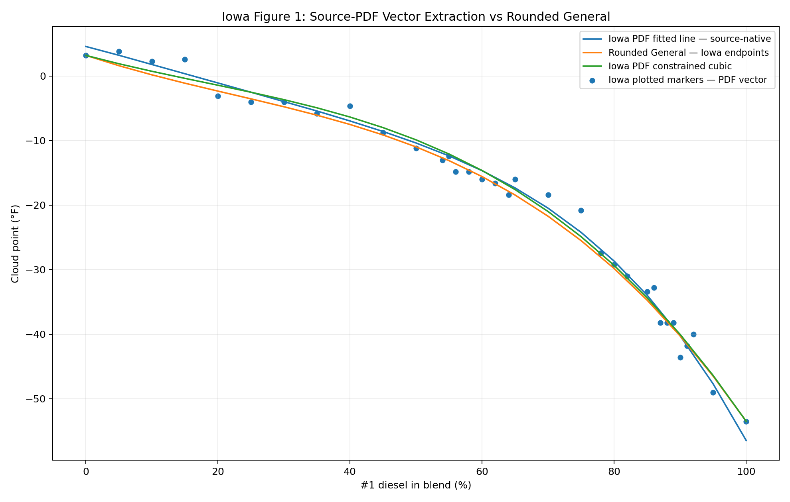
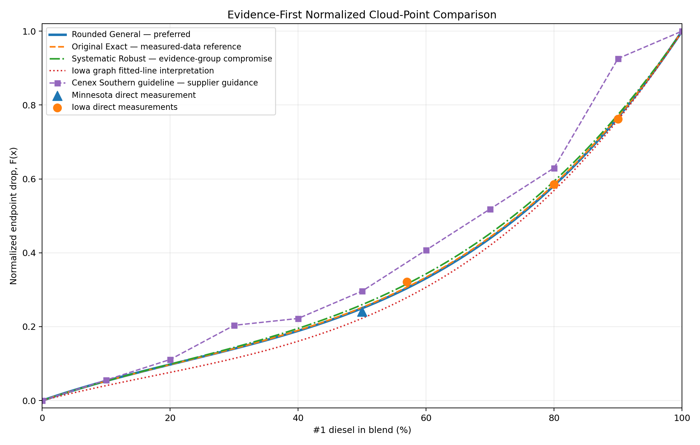

# Validation and Model Comparison

This project now treats “validation” as a set of comparisons rather than proof that one equation is universally correct.

The strongest general conclusions are:

1. ordinary #1/#2 petroleum cloud-point blending is nonlinear;
2. the Minnesota/Iowa data favor a shallower early drop than straight interpolation to realistic #1 endpoints;
3. Cenex supplier guidance is somewhat more aggressive through parts of the 30–70% range;
4. the Rounded/Original family remains slightly colder than the source-native Iowa PDF regression through most of the interior range, while remaining less aggressive than several Cenex-oriented experimental shapes; and
5. more flexible mathematical families did not generalize better than a constrained cubic in the project's leave-one-evidence-group-out test.

## 1. Direct measured-data checks

### Minnesota 50/50

```text
#2 = +2°F
#1 = -52°F
Measured 50/50 = -11°F
```

Normalized measured drop:

```text
F = 13/54 ≈ 0.24074
```

Rounded general cubic:

```text
F(0.5) = 0.25
CP = 2 + (-52 - 2) × 0.25 = -11.5°F
error = -0.5°F
```

Original exact cubic:

```text
F(0.5) ≈ 0.2521
CP ≈ -11.61°F
error ≈ -0.61°F
```

Both are close relative to normal fuel/test variability.

### A useful exact property of the rounded formula

The rounded cubic has an especially intuitive midpoint property:

```text
F(0.5) = 0.25 exactly
```

That means a 50/50 volume blend is modeled as having moved exactly **25% of the cloud-point span from the #2 endpoint toward the #1 endpoint**. It is not assumed to sit halfway between the two endpoint temperatures.

For example, with +14°F #2 and -55°F #1:

```text
span = -55 - 14 = -69°F
CP(0.5) = 14 + (-69 × 0.25)
        = -3.25°F
```

This exact quarter-span midpoint is a convenient interpretation of the rounded model and one reason it remains useful as a simple research baseline.

## 2. Iowa explicit petroleum points

Iowa endpoints:

```text
#2 = +3.2°F
#1 = -53.5°F
```

Approximate comparisons:

| #1 | Iowa CP | Rounded general | Original exact |
|---:|---:|---:|---:|
| 57% | -15°F | -14.05°F | -14.20°F |
| 80% | -30°F | -29.82°F | -29.99°F |
| 90% | -40°F | -40.28°F | -40.39°F |

Across the Minnesota 50% point plus those three Iowa points, the original exact cubic had only a tiny numerical advantage over the rounded formula; the rounded version remained preferable for simplicity.

A direct comparison over those four measured points makes the distinction clearer:

| Model | RMSE vs direct MN/Iowa points | MAE vs direct MN/Iowa points |
|---|---:|---:|
| **Original exact cubic** | **0.54°F** | **0.45°F** |
| **Rounded general cubic** | **0.56°F** | **0.48°F** |
| Systematic robust cubic | 0.68°F | 0.62°F |

The exact cubic is essentially the endpoint-constrained least-squares cubic of this direct measured-point set. The rounded model gives up only about **0.02°F RMSE** while gaining much simpler coefficients and the exact `F(0.5)=0.25` interpretation. The systematic robust cubic remains close, but it moves slightly away from the direct measurements because it was designed to compromise among broader historical evidence groups, including two Cenex-derived supplier-guidance groups.

## 3. Iowa full-curve validation — direct source-PDF vector extraction

The Iowa full-curve comparison went through three increasingly rigorous passes:

1. **first screenshot pass** — the traced fitted line was normalized by its own traced endpoints, which made agreement look artificially tight;
2. **absolute-temperature screenshot pass** — the screenshot axes were calibrated in °F and the rounded formula was evaluated with Iowa's measured +3.2/-53.5°F endpoints; and
3. **source-native PDF pass** — the original PDF was inspected directly and the fitted line and plotted markers were extracted from their vector objects.

The third pass is now preferred.

### The displayed Iowa regression is not endpoint constrained

Direct extraction of the fitted line from Figure 1 gives approximately:

```text
regression at 0% #1   ≈ +4.58°F
regression at 100% #1 ≈ -56.47°F
```

The report's measured neat-fuel values remain:

```text
#2 = +3.2°F
#1 = -53.5°F
```

So the displayed regression overshoots both measured endpoints. That is a property of the regression line itself; it is not a digitization error and it should not be silently forced away when reproducing the source figure.

A descriptive fourth-order polynomial reproduces the extracted vector path to about 0.01°F RMSE:

```text
CPpdf(x) ≈ 4.57014
           - 26.54218x
           - 17.18273x²
           + 59.33636x³
           - 76.63960x⁴
```

This is a **project reconstruction**, not an equation published by Iowa Central.

### Rounded General vs. the source-native Iowa line

Using Iowa's measured +3.2/-53.5°F endpoints for the Rounded General model:

| #1 | Rounded General | Iowa PDF fitted line | Rounded − Iowa |
|---:|---:|---:|---:|
| 10% | +0.18°F | +1.79°F | -1.60°F |
| 20% | -2.33°F | -1.07°F | -1.26°F |
| 30% | -4.76°F | -3.96°F | -0.80°F |
| 40% | -7.50°F | -6.96°F | -0.54°F |
| 50% | -10.98°F | -10.37°F | -0.60°F |
| 60% | -15.58°F | -14.66°F | -0.92°F |
| 70% | -21.73°F | -20.48°F | -1.25°F |
| 80% | -29.82°F | -28.67°F | -1.15°F |
| 90% | -40.28°F | -40.26°F | -0.02°F |

Negative values mean the Rounded General model is colder.

On a regular 5% grid:

```text
10–80%:
RMSE ≈ 1.05°F
MAE  ≈ 0.99°F
maximum absolute difference ≈ 1.60°F

10–90%:
RMSE ≈ 1.00°F
MAE  ≈ 0.92°F
maximum absolute difference ≈ 1.60°F
```

This confirms the earlier qualitative conclusion while tightening the source handling: the rounded model is usually modestly colder, and agreement is especially close near 90%.



The underlying source-path extraction and comparison values are retained in:

- [`Data/iowa-pdf-vector-fitted-line.csv`](Data/iowa-pdf-vector-fitted-line.csv)
- [`Data/iowa-pdf-vector-plotted-points.csv`](Data/iowa-pdf-vector-plotted-points.csv)
- [`Data/iowa-pdf-rounded-comparison.csv`](Data/iowa-pdf-rounded-comparison.csv)

## 4. Iowa PDF-derived endpoint-constrained project models

The raw Iowa regression is useful for **source reproduction**, but most calculator models require exact entered endpoints. The project therefore keeps a second, explicitly transformed interpretation for normalized model comparison.

### Endpoint-constrained fit to the direct-PDF fitted line

```text
Fcurve(x) = 0.484285x - 0.606821x² + 1.122537x³
```

This cubic is fit to the direct-PDF regression path while enforcing:

```text
F(0) = 0
F(1) = 1
```

With the same Iowa +3.2/-53.5°F endpoints, the Rounded General model is only about **0.2–1.2°F colder through 10–90%** than this constrained Iowa interpretation; the largest difference is about **1.15°F around 40% #1**.

### Endpoint-constrained fit to the direct-PDF plotted markers

```text
Fpoints(x) = 0.536995x - 0.731212x² + 1.194217x³
```

These equations supersede the earlier screenshot-derived graph diagnostics. They remain **project-developed equations**, not equations published by Iowa Central.

The source-native regression, plotted markers, and these constrained fits should not be counted as independent publications. They are different representations of the same Iowa figure.

### Evidence-first normalized comparison

The primary model-selection visual is a normalized evidence chart rather than the +14/-50°F model-history chart:



The revised figure now distinguishes:

- direct Minnesota/Iowa retained measurements;
- Iowa plotted markers extracted directly from the PDF;
- the **source-native Iowa fitted line**, shown without pretending it hits the measured endpoints;
- the endpoint-constrained Iowa PDF project cubic;
- Rounded General and Original Exact;
- Systematic Robust; and
- the Cenex Southern Region supplier guideline.

The important visual conclusions remain:

- **Original Exact** and **Rounded General** stay very close to the retained direct Minnesota/Iowa points;
- the source-native Iowa line is generally warmer/shallower through much of the interior range;
- the Systematic Robust curve is a historical evidence-group compromise rather than a superior measured-data fit; and
- Cenex Southern is supplier guidance, not the truth curve every general model should be optimized against.

The underlying values are retained in [`Data/evidence-first-normalized-comparison.csv`](Data/evidence-first-normalized-comparison.csv).

## 5. Cenex 3°F rule after normalization

Cenex's rule of thumb can be normalized against the regional endpoint guidance.

Southern reference:

```text
#2 ≈ +14°F
#1 ≈ -40°F
span = 54°F
```

Northern reference:

```text
#2 ≈ +6°F
#1 ≈ -60°F
span = 66°F
```

A useful cross-source detail is that the **54°F southern Cenex span exactly matches the Minnesota test span** (+2°F to -52°F), even though both Cenex southern endpoints are about 12°F warmer. The Iowa test span (+3.2°F to -53.5°F) is also close at 56.7°F. This supports comparing the sources in normalized coordinates, while not implying that equal endpoint span guarantees an identical blend curve.

Each 3°F step is therefore a different normalized fraction of the total span.

At lower blend percentages the rounded/original curves generally fall close to or between these regional interpretations, which explains why the old 3°F rule continued to look reasonable even after the unrealistic -16°F neat-#1 endpoint was rejected.

### Rate-of-change interpretation

The 3°F rule is also useful as a **slope reference**.

On the model-error chart, most nonlinear formulas remain in the same general pattern as the 3°F rule through the low-percentage range. Around the mid-30s to low-40s percent #1, the nonlinear family begins to develop a steeper local cloud-point reduction than a fixed 3°F-per-10% line. From there the linear rule increasingly diverges because it is mathematically incapable of accelerating.

This is why the 3°F rule can appear to “peel away” from the rest of the model family around 40% on a chart sampled in 10% increments. The project does **not** interpret 40% as a hard breakpoint. The crossing is gradual, and its exact plotted location depends on the endpoint pair, the source curve, and the 10% sampling interval.

The important cross-source observation is broader:

```text
low #1 fraction        -> relatively shallow CP reduction
mid-30s / low-40s      -> local slope near the 3°F-per-10% rule
higher #1 fractions    -> nonlinear curves steepen beyond 3°F per 10%
```

The Iowa-derived graph fits show the same qualitative steepening, so this divergence is not solely an Cenex Southern-chart artifact.

## 6. Cenex Southern Region guideline comparison (Agtegra-hosted)

The chart is treated as **Cenex/CHS supplier guidance**. Agtegra is retained in the citation because its site hosts the page/image used by the project; it is not treated as a separate independent data origin.

Approximate chart points:

```text
0:+14, 10:+11, 20:+8, 30:+3, 40:+2,
50:-2, 60:-8, 70:-14, 80:-20, 90:-36, 100:-40°F
```

The project now uses +14/-50°F as its **working comparison pair** for model-history temperature charts. The -50°F #1 value is a project compromise between Cenex southern guidance around -40°F and the approximately -52 to -53.5°F measured Minnesota/Iowa #1 values. It is not claimed as the Cenex chart's actual #1 endpoint or as one universal #1 specification.

**Important chart-reading note:** the full-model figure is a **model-history / supplier-guideline comparison**, not an evidence-quality ranking. The normalized project formulas in that figure are evaluated using the +14/-50°F working endpoints, while the plotted Cenex Southern guideline itself reaches approximately -40°F at neat #1. The normalized formulas are therefore forced to end 10°F colder than that supplier reference. This intentionally makes the chart sensitive to the endpoint assumption and is another reason that closeness to the Cenex line must not be read as an evidence ranking.

Full model comparison:


Error relative to the interpolated Cenex Southern guideline:


Changing the working #1 endpoint from -45°F to -50°F materially changes the numerical ranking against the fixed Cenex Southern guideline. In the +14/-50°F chart, the Rounded General curve happens to have the lowest 10–80% RMSE among the retained plotted models at about **1.40°F**. That does **not** make it a Cenex-fitted model; it illustrates how strongly an absolute-temperature supplier-error ranking depends on the endpoint pair used to scale normalized formulas.

For a public general model, evidence hierarchy and measured-data behavior are therefore more informative than the last fraction of a degree against this one supplier chart.

The preserved **Cenex Literature Cubic** is also shown. Unlike the later Cenex Southern-guideline test fit, it was **not optimized to the Southern chart**. It is constrained by the Cenex 3°F-per-10% starting rate, the derived -1°F 50/50 anchor, +14°F #2, and the selected neat-#1 endpoint. With the +14/-50°F working comparison pair, its 10–80% RMSE against the Southern guideline is about **1.77°F**.

### Wintermaster whole-calculator consistency check

Cenex Wintermaster provides a useful **external consistency / sanity check** because the source material used by this project describes the product as roughly 70% #1 / 30% #2 and gives published specifications of approximately -20°F cloud point, -37°F CFPP, and -30°F operability.

Using the rounded empirical cloud-point model with a generic +14°F #2 endpoint and -55°F #1 endpoint:

```text
x = 0.70
F(0.70) = 0.4396
CP = 14 + (-55 - 14) × 0.4396
   ≈ -16.3°F
```

Applying the calculator's 12°F cold-flow/operability planning allowance gives:

```text
-16.3°F - 12°F ≈ -28.3°F estimated operability
```

Comparison:

| Item | Temperature |
|---|---:|
| Rounded-model CP at 70/30 | -16.3°F |
| With 12°F operability allowance | -28.3°F |
| Cenex published Wintermaster operability | -30°F |
| With Cenex 15°F maximum-delta guidance | -31.3°F |

The default 12°F result lands within about **1.7°F** of the published Wintermaster operability figure. That is encouraging because it checks the cloud-point model and the independently selected operability allowance together.

It should **not** be interpreted as proof that the model reproduces the Wintermaster formulation. The actual component cloud points, refinery streams, additive package, and blending process used for Wintermaster are not known here. The published Wintermaster cloud point (-20°F) also differs by about 3.7°F from the generic-endpoint model estimate (-16.3°F), which is a useful reminder that this is a reasonableness check rather than a product reconstruction.

## 7. Why 30%, 60%, and 90% repeatedly stand out

These percentages are not mathematically magical; the behavior comes from the interaction of smooth endpoint-constrained curves with the supplier reference shape.

### Around 30%

Most project cubics have an inflection in roughly the 20–30% region. At the same time, the Cenex Southern Region chart changes from approximately:

```text
20%: +8°F
30%: +3°F   (5°F drop)
40%: +2°F   (only 1°F more)
```

A smooth cubic cannot create a sharp local knee without moving neighboring percentages too. Improving 30% therefore tends to move 10–20% or 40–50% as well.

### Around 60%

The Cenex Southern Region chart is almost linear from about 50–80% at roughly 6°F per 10% step, while the cubic family is still smoothly accelerating. Many cubics therefore remain somewhat warm around 60–70% and then catch back up near 80%.

### Around 90%

Cenex approximately shows:

```text
80 -> 90: -20 to -36°F = 16°F drop
90 -> 100: -36 to -40°F = 4°F drop
```

That sharp cliff followed by rapid flattening is difficult for one smooth endpoint-constrained cubic to reproduce without distorting the rest of the curve.

The fact that many independently derived smooth formulas cluster several degrees warmer than the 90% Cenex point is therefore treated as a reason for **reduced point leverage**, not as a reason to bend the entire model around one approximate chart reading.

## 8. Why endpoint-constrained cubics tend to look similar

For two cubics that both satisfy `F(0)=0` and `F(1)=1`, their difference is constrained to be zero at both endpoints. The difference can be written in a form similar to:

```text
ΔF = x(1-x)(A + Bx)
```

That means one cubic cannot independently “fix” arbitrary errors at 30%, 60%, and 90%. Moving one broad part of the curve necessarily moves neighboring regions.

This structural constraint explains why many of the project cubics form a tight family even when their coefficients look different.

## 9. Systematic single-formula model-family pass

After many exploratory formulas were tried, the project froze the major fitting evidence groups and compared several **single-formula families** under the same rules.

Tested families:

- endpoint-constrained cubic;
- endpoint-constrained quartic;
- monotonic Bernstein quartic; and
- simple rational curve.

Development choices:

- exact endpoints;
- monotonicity;
- comparable influence for major fitting evidence groups;
- robust loss to reduce leverage of isolated chart anomalies; and
- leave-one-evidence-group-out evaluation.

**Iowa-data verification:** the Iowa evidence group in this systematic pass used the explicit published stock-blend evidence, not the screenshot-derived Iowa fitted-line or plotted-points equations. The direct-PDF re-extraction therefore leaves the systematic coefficients and LOO ranking unchanged.

Resulting formulas are listed in [MODEL-CATALOG.md](MODEL-CATALOG.md).

### Leave-one-evidence-group-out result

Average held-out normalized RMSE from the project test:

| Family | Average LOO RMSE |
|---|---:|
| **Endpoint cubic** | **0.0347** |
| Monotonic Bernstein quartic | 0.0392 |
| Rational | 0.0415 |
| Endpoint quartic | 0.0459 |


The quartic can fit the combined development set more flexibly, but its poorer held-out performance suggests that the extra degree of freedom was fitting source-specific detail rather than a stable common shape.

### Systematic evidence-group compromise cubic

```text
F(x) = 0.583960x - 0.675308x² + 1.091348x³
```

This result is notable because it is close to both:

```text
original exact:
0.59136x - 0.75721x² + 1.16585x³
```

and the earlier independently obtained source-balanced cubic:

```text
0.5983x - 0.7094x² + 1.1111x³
```

Two different aggregation approaches therefore converged on nearly the same region of coefficient space.

That convergence is useful, but the scope of the result matters. The systematic pass answers: **which tested mathematical family best compromises among the four historical fitting evidence groups under comparable group influence?** It does not answer: **which curve best represents the highest-ranked direct petroleum measurements?** For the latter question, the Original Exact / Rounded General family remains the stronger reference.


## 10. Counterexamples and domain limits

CRC Report 650 and older specialized winter-fuel examples show that already-winterized/arctic fuel pairs can have a substantially different normalized blend shape.

This is not a failure of one particular coefficient set; it is evidence that **endpoint cloud points alone do not contain enough information to uniquely determine wax precipitation behavior for every petroleum stream**.

The calculator should therefore expose model assumptions and actual endpoint inputs rather than advertise one formula as a universal physical law.

## 11. Recommended interpretation of model-error metrics

Do not rank models by one error number alone.

A useful production/research choice should consider:

- measured-data error;
- supplier-guidance error;
- whether colder-than-reference errors are operationally more concerning;
- worst-case error;
- provenance/evidence-group balance;
- leave-one-evidence-group-out behavior;
- monotonicity;
- endpoint behavior; and
- explainability to a third party.

That is why a slightly higher-error single cubic may be preferable to a piecewise or highly localized model that appears more accurate only because it is tuned directly to approximate chart points.

For the current project interpretation, model choice is separated by purpose:

- **Rounded General Cubic** — preferred general petroleum model;
- **Original Exact Cubic** — direct Minnesota/Iowa measured-data reference;
- **Cenex Literature Cubic** — Cenex-literature/rule-oriented reference;
- **Systematic Robust Cubic** — balanced historical evidence-group compromise and model-family research result; and
- **Cenex Southern-oriented test/hybrid models** — supplier-guideline diagnostics rather than evidence that colder predictions are intrinsically more correct.
