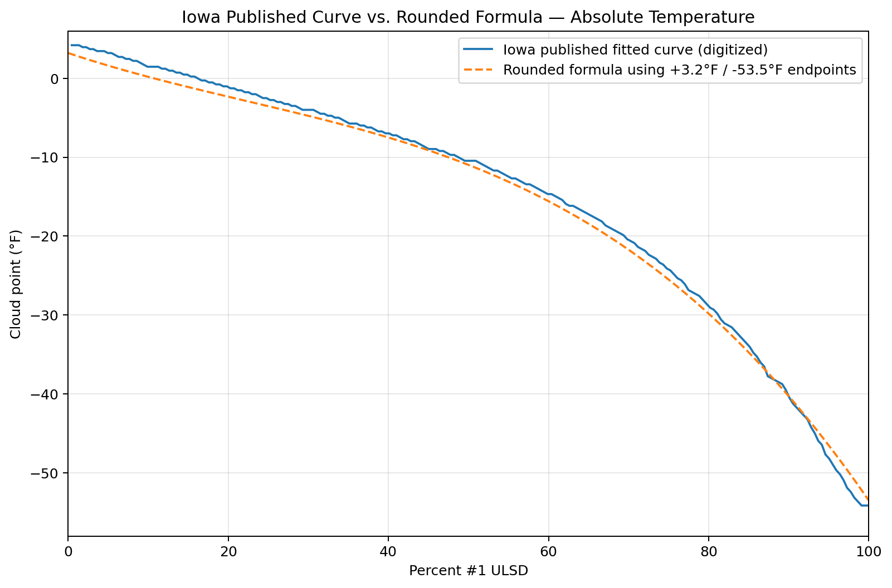
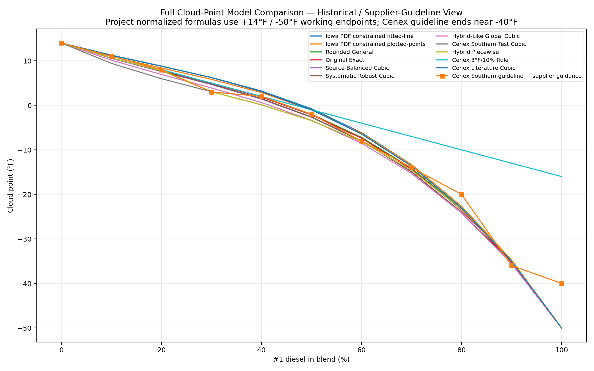
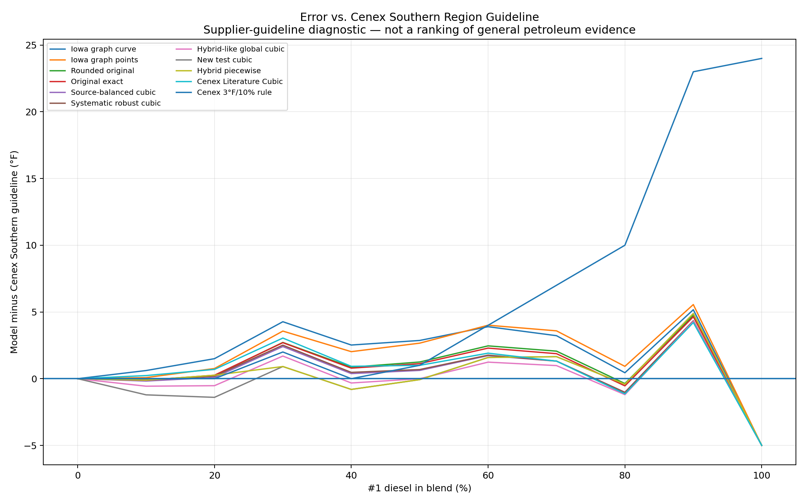
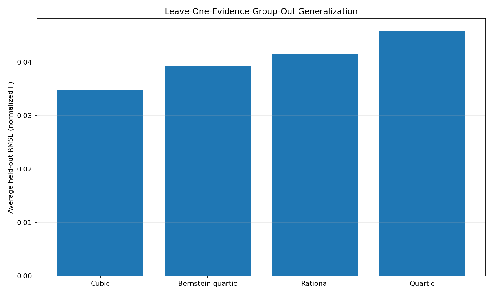
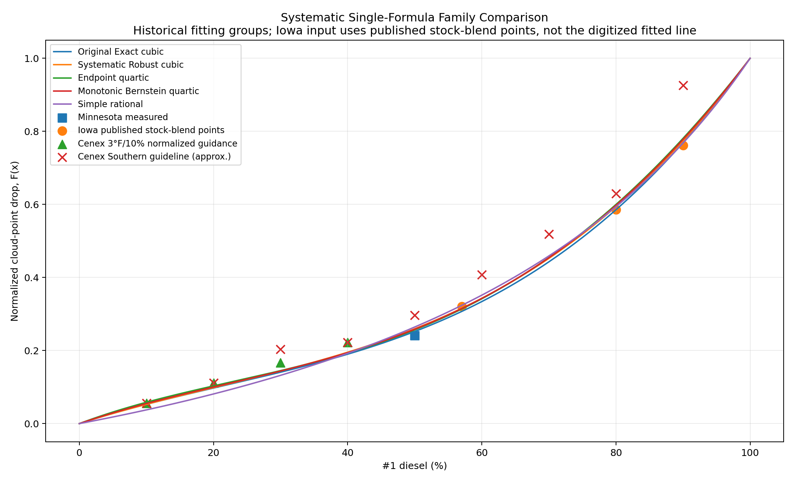

# Validation and Model Comparison

This project now treats “validation” as a set of comparisons rather than proof that one equation is universally correct.

The strongest general conclusions are:

1. ordinary #1/#2 petroleum cloud-point blending is nonlinear;
2. the Minnesota/Iowa data favor a shallower early drop than straight interpolation to realistic #1 endpoints;
3. Cenex supplier guidance is somewhat more aggressive through parts of the 30–70% range;
4. the original cubic family sits between the Iowa graph-derived shapes and the more aggressive supplier-guidance shapes; and
5. more flexible mathematical families did not generalize better than a constrained cubic in the project's leave-one-evidence-group-out test.

## 1. Direct measured-data checks

### Minnesota 50/50

```text
#2 = +2°F
#1 = -52°F
Measured 50/50 = -11°F
```

Normalized measured drop:

```text
F = 13/54 ≈ 0.24074
```

Rounded general cubic:

```text
F(0.5) = 0.25
CP = 2 + (-52 - 2) × 0.25 = -11.5°F
error = -0.5°F
```

Original exact cubic:

```text
F(0.5) ≈ 0.2521
CP ≈ -11.61°F
error ≈ -0.61°F
```

Both are close relative to normal fuel/test variability.

### A useful exact property of the rounded formula

The rounded cubic has an especially intuitive midpoint property:

```text
F(0.5) = 0.25 exactly
```

That means a 50/50 volume blend is modeled as having moved exactly **25% of the cloud-point span from the #2 endpoint toward the #1 endpoint**. It is not assumed to sit halfway between the two endpoint temperatures.

For example, with +14°F #2 and -55°F #1:

```text
span = -55 - 14 = -69°F
CP(0.5) = 14 + (-69 × 0.25)
        = -3.25°F
```

This exact quarter-span midpoint is a convenient interpretation of the rounded model and one reason it remains useful as a simple research baseline.

## 2. Iowa explicit petroleum points

Iowa endpoints:

```text
#2 = +3.2°F
#1 = -53.5°F
```

Approximate comparisons:

| #1 | Iowa CP | Rounded general | Original exact |
|---:|---:|---:|---:|
| 57% | -15°F | -14.05°F | -14.20°F |
| 80% | -30°F | -29.82°F | -29.99°F |
| 90% | -40°F | -40.28°F | -40.39°F |

Across the Minnesota 50% point plus those three Iowa points, the original exact cubic had only a tiny numerical advantage over the rounded formula; the rounded version remained preferable for simplicity.

## 3. Corrected Iowa full-curve digitization

An early normalized overlay accidentally made agreement look tighter than it really was because the traced graph was normalized by its own traced endpoints. That was later corrected by anchoring the graph's temperature axis and comparing the Iowa fitted line in **absolute temperature** against the formula using Iowa's known +3.2/-53.5°F endpoints.

Preferred corrected figure:



The corrected digitization showed the rounded/original project curve generally about **0.5–1.3°F colder** than the plotted Iowa fitted line through much of 10–80%, while agreement became very close around 90%.

This correction is important because it prevents the project from overstating agreement.

## 4. Two Iowa graph-derived cubic models

Later, the Iowa graph was treated as a source for two independent project fits:

### Fit to the displayed fitted line

```text
Fcurve(x) = 0.4510x - 0.5719x² + 1.1210x³
```

### Fit to digitized plotted points

```text
Fpoints(x) = 0.5719x - 0.9072x² + 1.3353x³
```

Both are generally warmer / less aggressive through the middle than the original exact cubic.

This creates a useful evidence ordering through much of the practical range:

```text
Iowa graph-derived shapes
        -> original project cubic family
        -> more aggressive Cenex Southern-guideline-oriented shapes
```

That is one reason the original family remains defensible even after the supplier-oriented research.

## 5. Cenex 3°F rule after normalization

Cenex's rule of thumb can be normalized against the regional endpoint guidance.

Southern reference:

```text
#2 ≈ +14°F
#1 ≈ -40°F
span = 54°F
```

Northern reference:

```text
#2 ≈ +6°F
#1 ≈ -60°F
span = 66°F
```

A useful cross-source detail is that the **54°F southern Cenex span exactly matches the Minnesota test span** (+2°F to -52°F), even though both Cenex southern endpoints are about 12°F warmer. The Iowa test span (+3.2°F to -53.5°F) is also close at 56.7°F. This supports comparing the sources in normalized coordinates, while not implying that equal endpoint span guarantees an identical blend curve.

Each 3°F step is therefore a different normalized fraction of the total span.

At lower blend percentages the rounded/original curves generally fall close to or between these regional interpretations, which explains why the old 3°F rule continued to look reasonable even after the unrealistic -16°F neat-#1 endpoint was rejected.

### Rate-of-change interpretation

The 3°F rule is also useful as a **slope reference**.

On the model-error chart, most nonlinear formulas remain in the same general pattern as the 3°F rule through the low-percentage range. Around the mid-30s to low-40s percent #1, the nonlinear family begins to develop a steeper local cloud-point reduction than a fixed 3°F-per-10% line. From there the linear rule increasingly diverges because it is mathematically incapable of accelerating.

This is why the 3°F rule can appear to “peel away” from the rest of the model family around 40% on a chart sampled in 10% increments. The project does **not** interpret 40% as a hard breakpoint. The crossing is gradual, and its exact plotted location depends on the endpoint pair, the source curve, and the 10% sampling interval.

The important cross-source observation is broader:

```text
low #1 fraction        -> relatively shallow CP reduction
mid-30s / low-40s      -> local slope near the 3°F-per-10% rule
higher #1 fractions    -> nonlinear curves steepen beyond 3°F per 10%
```

The Iowa-derived graph fits show the same qualitative steepening, so this divergence is not solely an Cenex Southern-chart artifact.

## 6. Cenex Southern Region guideline comparison (Agtegra-hosted)

The chart is treated as **Cenex/CHS supplier guidance**. Agtegra is retained in the citation because its site hosts the page/image used by the project; it is not treated as a separate independent data origin.

Approximate chart points:

```text
0:+14, 10:+11, 20:+8, 30:+3, 40:+2,
50:-2, 60:-8, 70:-14, 80:-20, 90:-36, 100:-40°F
```

The project repeatedly used +14/-45°F as a **working comparison pair** when visualizing candidate formulas. That pair is not claimed as the Cenex chart's actual #1 endpoint; it was chosen to compare production-oriented formulas under a slightly conservative #1 assumption.

Full model comparison:



Error relative to the interpolated Cenex Southern guideline:



The piecewise hybrid produced the smallest practical-range error among several exploratory models, but it accomplishes that by explicitly using different behavior below and above a chosen transition range.

For a public single-formula model, methodological simplicity may be more valuable than the last fraction of a degree of fit.

The preserved **Cenex Literature Cubic** is also shown in this comparison. Unlike the later Cenex Southern-guideline test fit, it was **not optimized to this chart**. It is constrained by the Cenex 3°F-per-10% starting rate, the derived -1°F 50/50 anchor, +14°F #2, and the selected neat-#1 endpoint. With the +14/-45°F comparison endpoints used here, its 10–80% RMSE against the Southern guideline is about **1.51°F**. That is close to the original exact cubic, while retaining a much clearer Cenex-literature rationale.

### Wintermaster whole-calculator consistency check

Cenex Wintermaster provides a useful **external consistency / sanity check** because the source material used by this project describes the product as roughly 70% #1 / 30% #2 and gives published specifications of approximately -20°F cloud point, -37°F CFPP, and -30°F operability.

Using the rounded empirical cloud-point model with a generic +14°F #2 endpoint and -55°F #1 endpoint:

```text
x = 0.70
F(0.70) = 0.4396
CP = 14 + (-55 - 14) × 0.4396
   ≈ -16.3°F
```

Applying the calculator's 12°F cold-flow/operability planning allowance gives:

```text
-16.3°F - 12°F ≈ -28.3°F estimated operability
```

Comparison:

| Item | Temperature |
|---|---:|
| Rounded-model CP at 70/30 | -16.3°F |
| With 12°F operability allowance | -28.3°F |
| Cenex published Wintermaster operability | -30°F |
| With Cenex 15°F maximum-delta guidance | -31.3°F |

The default 12°F result lands within about **1.7°F** of the published Wintermaster operability figure. That is encouraging because it checks the cloud-point model and the independently selected operability allowance together.

It should **not** be interpreted as proof that the model reproduces the Wintermaster formulation. The actual component cloud points, refinery streams, additive package, and blending process used for Wintermaster are not known here. The published Wintermaster cloud point (-20°F) also differs by about 3.7°F from the generic-endpoint model estimate (-16.3°F), which is a useful reminder that this is a reasonableness check rather than a product reconstruction.

## 7. Why 30%, 60%, and 90% repeatedly stand out

These percentages are not mathematically magical; the behavior comes from the interaction of smooth endpoint-constrained curves with the supplier reference shape.

### Around 30%

Most project cubics have an inflection in roughly the 20–30% region. At the same time, the Cenex Southern Region chart changes from approximately:

```text
20%: +8°F
30%: +3°F   (5°F drop)
40%: +2°F   (only 1°F more)
```

A smooth cubic cannot create a sharp local knee without moving neighboring percentages too. Improving 30% therefore tends to move 10–20% or 40–50% as well.

### Around 60%

The Cenex Southern Region chart is almost linear from about 50–80% at roughly 6°F per 10% step, while the cubic family is still smoothly accelerating. Many cubics therefore remain somewhat warm around 60–70% and then catch back up near 80%.

### Around 90%

Cenex approximately shows:

```text
80 -> 90: -20 to -36°F = 16°F drop
90 -> 100: -36 to -40°F = 4°F drop
```

That sharp cliff followed by rapid flattening is difficult for one smooth endpoint-constrained cubic to reproduce without distorting the rest of the curve.

The fact that many independently derived smooth formulas cluster several degrees warmer than the 90% Cenex point is therefore treated as a reason for **reduced point leverage**, not as a reason to bend the entire model around one approximate chart reading.

## 8. Why endpoint-constrained cubics tend to look similar

For two cubics that both satisfy `F(0)=0` and `F(1)=1`, their difference is constrained to be zero at both endpoints. The difference can be written in a form similar to:

```text
ΔF = x(1-x)(A + Bx)
```

That means one cubic cannot independently “fix” arbitrary errors at 30%, 60%, and 90%. Moving one broad part of the curve necessarily moves neighboring regions.

This structural constraint explains why many of the project cubics form a tight family even when their coefficients look different.

## 9. Systematic single-formula model-family pass

After many exploratory formulas were tried, the project froze the major fitting evidence groups and compared several **single-formula families** under the same rules.

Tested families:

- endpoint-constrained cubic;
- endpoint-constrained quartic;
- monotonic Bernstein quartic; and
- simple rational curve.

Development choices:

- exact endpoints;
- monotonicity;
- comparable influence for major fitting evidence groups;
- robust loss to reduce leverage of isolated chart anomalies; and
- leave-one-evidence-group-out evaluation.

Resulting formulas are listed in [MODEL-CATALOG.md](MODEL-CATALOG.md).

### Leave-one-evidence-group-out result

Average held-out normalized RMSE from the project test:

| Family | Average LOO RMSE |
|---|---:|
| **Endpoint cubic** | **0.0347** |
| Monotonic Bernstein quartic | 0.0392 |
| Rational | 0.0415 |
| Endpoint quartic | 0.0459 |



The quartic can fit the combined development set more flexibly, but its poorer held-out performance suggests that the extra degree of freedom was fitting source-specific detail rather than a stable common shape.

### Leading systematic cubic

```text
F(x) = 0.583960x - 0.675308x² + 1.091348x³
```

This result is notable because it is close to both:

```text
original exact:
0.59136x - 0.75721x² + 1.16585x³
```

and the earlier independently obtained source-balanced cubic:

```text
0.5983x - 0.7094x² + 1.1111x³
```

Two different aggregation approaches therefore converged on nearly the same region of coefficient space.



## 10. Counterexamples and domain limits

CRC Report 650 and older specialized winter-fuel examples show that already-winterized/arctic fuel pairs can have a substantially different normalized blend shape.

This is not a failure of one particular coefficient set; it is evidence that **endpoint cloud points alone do not contain enough information to uniquely determine wax precipitation behavior for every petroleum stream**.

The calculator should therefore expose model assumptions and actual endpoint inputs rather than advertise one formula as a universal physical law.

## 11. Recommended interpretation of model-error metrics

Do not rank models by one error number alone.

A useful production/research choice should consider:

- measured-data error;
- supplier-guidance error;
- whether colder-than-reference errors are operationally more concerning;
- worst-case error;
- provenance/evidence-group balance;
- leave-one-evidence-group-out behavior;
- monotonicity;
- endpoint behavior; and
- explainability to a third party.

That is why a slightly higher-error single cubic may be preferable to a piecewise or highly localized model that appears more accurate only because it is tuned directly to approximate chart points.
